# Hacker News Best Stories API

An ASP.NET Core (.NET 10) RESTful API that returns the best `n` stories from the
[Hacker News API](https://github.com/HackerNews/API), ordered by score (descending), and that can serve a very large
number of requests **without** putting that load on Hacker News.

```http
GET /api/v1/stories/best?count=3
```

```json
[
  {
    "title": "A uBlock Origin update was rejected from the Chrome Web Store",
    "uri": "https://github.com/uBlockOrigin/uBlock-issues/issues/745",
    "postedBy": "ismaildonmez",
    "time": "2019-10-12T13:43:01+00:00",
    "score": 1716,
    "commentCount": 572
  }
]
```

---

## Running it

### Prerequisites

- [.NET SDK 10](https://dotnet.microsoft.com/download) (pinned through `global.json`)
- Docker (optional)

### With the .NET CLI

```bash
dotnet run --project src/BestStories.Api
```

Then open <http://localhost:5080> (it redirects to the interactive [Scalar](https://scalar.com) API reference), or:

```bash
curl "http://localhost:5080/api/v1/stories/best?count=10"
```

### With Docker Compose (API + telemetry dashboard)

```bash
docker compose up --build
```

| URL                                                  | What                                                  |
| ---------------------------------------------------- | ----------------------------------------------------- |
| <http://localhost:8080/scalar>                       | API reference                                         |
| <http://localhost:8080/api/v1/stories/best?count=10> | The endpoint                                          |
| <http://localhost:18888>                             | Aspire dashboard: traces, metrics and structured logs |

The .NET SDK can also build the same chiseled image without a Dockerfile, and without a Docker daemon when it
writes to an archive:

```bash
dotnet publish src/BestStories.Api -c Release -t:PublishContainer -p:ContainerBaseImage=mcr.microsoft.com/dotnet/aspnet:10.0-noble-chiseled -p:ContainerArchiveOutputPath=best-stories-api.tar.gz
```

### Tests

```bash
dotnet test
```

---

## API

### `GET /api/v1/stories/best?count={n}`

| Parameter | Type | Rules                    |
| --------- | ---- | ------------------------ |
| `count`   | int  | Required, `1` to `200`   |

| Status | When                                                                                         |
| ------ | -------------------------------------------------------------------------------------------- |
| `200`  | Array of up to `n` stories, highest score first.                                             |
| `304`  | The `If-None-Match` header matches the current `ETag` (nothing changed since the last call). |
| `400`  | `count` missing or out of range, as an RFC 9457 `application/problem+json` validation error. |
| `429`  | The client exceeded its rate limit; a `Retry-After` header is included.                     |
| `503`  | Cold start: the first snapshot could not be loaded within the timeout; retry shortly.        |

Response headers: `ETag` (a hash of the content, so it only changes when the ranking or a story changes, and is
identical across instances and restarts) and
`Cache-Control: public, max-age=<seconds until the next scheduled refresh>`.

### Real-time updates (SignalR)

Hub at `/hubs/best-stories`:

- `GetBestStories(count)`: returns the current top `count`.
- `BestStoriesUpdated(update)`: pushed to every client whenever the ranking or any story changes.

### Operations

| Endpoint             | Purpose                                                                                   |
| -------------------- | ----------------------------------------------------------------------------------------- |
| `GET /health/live`   | Liveness: the process is up.                                                              |
| `GET /health/ready`  | Readiness: `Unhealthy` until the first snapshot loads, `Degraded` when data is stale.     |
| `GET /openapi/v1.json` | OpenAPI 3.1 document.                                                                   |

---

## How it avoids overloading Hacker News

The key decision is to **decouple the request path from Hacker News completely**.

```mermaid
flowchart LR
    subgraph API process
        W[BestStoriesRefreshWorker<br/>BackgroundService] -->|every Interval| R[BestStoriesRefresher]
        R -->|bounded parallelism<br/>MaxConcurrency| C[HackerNewsClient<br/>typed HttpClient + resilience]
        R -->|atomic swap| S[(Immutable snapshot<br/>sorted by score)]
        R -->|on change| H[SignalR hub]
        E[GET /api/v1/stories/best] -->|O&#40;1&#41; read, Take n| S
    end
    C -->|~1 + 200 calls per Interval| HN[(Hacker News API)]
    Clients[Many clients] --> E
    Clients -.websocket.-> H
```



1. A hosted `BackgroundService` refreshes the data on a fixed interval (default: 1 minute). It fetches
   `beststories.json`, then every story item with a **bounded degree of parallelism** (`Parallel.ForEachAsync`,
   default 8 concurrent calls).
2. The stories are sorted once and published as an **immutable snapshot** (`ImmutableArray<Story>`) that is swapped
   atomically (`Volatile.Write`). Readers never lock and never see a half-built list.
3. Every API request is served from that snapshot in memory: an O(1) read plus `Take(n)`. The fast path completes
   synchronously (`ValueTask`) with no I/O.

The number of calls to Hacker News therefore depends **only on time** (about 201 calls per minute by default),
never on how many requests the API receives. 1 or 1,000,000 requests per minute cost Hacker News the same.

On top of that:

- **Cold start**: requests that arrive before the first snapshot all await the same `TaskCompletionSource`, so a
  burst of callers at startup still triggers exactly one load (covered by an acceptance test with 500 concurrent
  callers).
- **Resilience** (`Microsoft.Extensions.Http.Resilience`, built on Polly v8): per-attempt timeout, retries with
  exponential backoff and jitter, a circuit breaker and a total request timeout on the Hacker News client.
- **Graceful degradation**: if the id list can't be fetched the previous snapshot is kept. If a single story fails,
  its last known version is reused. Stale data is reported as `Degraded` by the readiness probe, not as an outage.
- **Conditional requests**: a content-hash `ETag` / `If-None-Match` lets clients and intermediaries skip the payload when nothing
  changed, and `Cache-Control` lets a CDN or reverse proxy absorb traffic in front of the service.
- **Rate limiting** (ASP.NET Core rate limiter): a per-client fixed window protects this service from a single noisy
  consumer.
- **Change detection**: a refresh that finds identical data doesn't bump the version, so ETags stay valid and no
  SignalR message is pushed.

---

## Architecture

```
src/
  BestStories.Core            Domain and use cases. No ASP.NET dependency.
    Stories/                  Story, StorySnapshot, BestStoriesRefresher, BestStoriesService, RefreshOptions
    Abstractions/             Ports: IHackerNewsClient, IStorySnapshotStore, IStorySnapshotObserver
    Diagnostics/              ActivitySource and Meter (OpenTelemetry)
  BestStories.Infrastructure  Adapters
    HackerNews/               Typed HttpClient, HN DTO + System.Text.Json source generation
    Snapshots/                In-memory snapshot store, background worker, health check
    DependencyInjection.cs    Composition: options validation, resilience pipeline, hosted service
  BestStories.Api             Minimal API host
    Stories/                  Endpoint, response contract, SignalR hub and broadcaster
    Hosting/                  Rate limiting, OpenTelemetry, JSON source-gen context
tests/
  BestStories.UnitTests       NUnit + Moq + Shouldly + FakeTimeProvider
  BestStories.IntegrationTests  WebApplicationFactory, SignalR client, Reqnroll (Gherkin) acceptance tests
```

This is a ports-and-adapters (hexagonal) layout: the core logic depends only on abstractions, so the Hacker News
client, the snapshot store (for example Redis) or the notification channel (for example RabbitMQ) can be replaced
without touching it.

### Technology choices

| Concern            | Choice                                                                                          |
| ------------------ | ----------------------------------------------------------------------------------------------- |
| Runtime            | .NET 10 / C# 14, Minimal APIs, `TypedResults`, built-in minimal API validation (`AddValidation`) |
| API docs           | `Microsoft.AspNetCore.OpenApi` (OpenAPI 3.1) + Scalar UI                                        |
| HTTP resilience    | `Microsoft.Extensions.Http.Resilience` standard pipeline (Polly v8)                             |
| Concurrency        | `Parallel.ForEachAsync`, immutable snapshot, `Volatile`, `TaskCompletionSource`, `ValueTask`   |
| Serialization      | `System.Text.Json` source generators (no reflection on the hot path)                            |
| Real time          | SignalR with strongly typed hub clients                                                         |
| Observability      | OpenTelemetry traces, metrics and logs (OTLP), custom `Meter`/`ActivitySource`, `[LoggerMessage]` source-generated logging |
| Configuration      | Options pattern with DataAnnotations validation at startup (`ValidateOnStart`)                  |
| Time               | `TimeProvider` everywhere, so time-based logic is deterministic under test                      |
| Build hygiene      | Central Package Management, `TreatWarningsAsErrors`, `latest-recommended` analyzers, nullable reference types |
| Container          | Multi-stage build, Ubuntu **chiseled** runtime image (distroless, non-root)                      |
| CI                 | GitHub Actions: build, test with coverage, Docker image build                                   |

---

## Configuration

All settings live under `BestStories` in `appsettings.json` and can be overridden with environment variables
(for example `BestStories__Refresh__Interval=00:00:30`). Invalid values stop the application at startup.

| Key                                   | Default                                  | Meaning                                           |
| ------------------------------------- | ---------------------------------------- | ------------------------------------------------- |
| `HackerNews:BaseAddress`              | `https://hacker-news.firebaseio.com/v0/` | Hacker News API base URL                          |
| `HackerNews:AttemptTimeout`           | `00:00:05`                               | Timeout for a single HTTP attempt                 |
| `HackerNews:MaxRetryAttempts`         | `3`                                      | Retries per call (exponential backoff + jitter)   |
| `Refresh:Interval`                    | `00:01:00`                               | How often the snapshot is rebuilt                 |
| `Refresh:RetryDelay`                  | `00:00:05`                               | Retry delay while no snapshot has loaded yet      |
| `Refresh:ColdStartTimeout`            | `00:00:15`                               | How long a request waits for the first snapshot   |
| `Refresh:MaxConcurrency`              | `8`                                      | Maximum parallel calls to Hacker News             |
| `Refresh:MaxStories`                  | `200`                                    | How many best stories are kept                    |
| `RateLimiting:PermitLimit`            | `100`                                    | Requests allowed per client per window            |
| `RateLimiting:Window`                 | `00:00:10`                               | Rate limit window                                 |

Telemetry is exported through OTLP when `OTEL_EXPORTER_OTLP_ENDPOINT` is set.

---

## Testing strategy

| Layer        | What is covered                                                                                                       |
| ------------ | --------------------------------------------------------------------------------------------------------------------- |
| Unit         | Ordering and tie-breaking, mapping and filtering of HN items, HTTP client parsing, refresh fallbacks, change detection, observer isolation, **max concurrency never exceeded**, lock-free snapshot swaps under concurrent readers, cold-start timeout and worker scheduling driven by `FakeTimeProvider`. |
| Integration  | Full HTTP pipeline via `WebApplicationFactory` with a fake Hacker News `HttpMessageHandler`: exact JSON contract, validation errors, ETag/304, health checks, OpenAPI, rate limiting, SignalR query and push. |
| Acceptance   | Gherkin scenarios (Reqnroll, the successor of SpecFlow) that read like the specification, including "500 concurrent callers result in exactly one call to Hacker News". |

---

## Assumptions

- "Best stories" is the list returned by `beststories.json` (up to 200 ids). That list is re-ranked by **score**, as
  the specification asks, because Hacker News orders it by its own ranking algorithm.
- `count` must be between 1 and 200. Asking for more stories than exist returns all available stories.
- Data up to one refresh interval old (1 minute by default) is acceptable. Scores on Hacker News change slowly, and
  the interval is configurable.
- Items that are deleted, dead, untitled or not of type `story` are left out. Stories without a URL (for example
  "Ask HN") are returned with `"uri": null`.
- Ties on score are broken by id, so the ordering is deterministic.
- `commentCount` maps to the Hacker News `descendants` field (total comments, not only top-level ones).

## What I would add with more time

- **Horizontal scaling**: with N instances, N workers would each poll Hacker News. I would elect a single refresher
  (a distributed lock in Redis or DynamoDB) and share the snapshot through Redis or `HybridCache`, or have the
  refresher publish snapshots on a message bus (RabbitMQ, SNS/SQS) that every API instance subscribes to.
- **Cheaper refreshes**: use `/v0/updates.json` or the Firebase streaming API to fetch only items that changed,
  instead of re-reading all 200 on every cycle.
- **Load and performance tests** (k6 or NBomber) in CI, with latency budgets, plus BenchmarkDotNet for the hot path.
- **Cloud deployment**: container on AWS ECS Fargate behind an ALB, CloudFront in front of `GET` endpoints for
  ETag/`Cache-Control`, infrastructure as code with AWS CDK or Terraform, and a CD pipeline.
- **Security**: authentication (JWT / API keys) and rate limits per API key rather than per IP, forwarded headers
  configured for the real proxy topology, and security headers.
- **Contract and architecture tests**: consumer-driven contracts (Pact), plus NetArchTest rules that enforce the
  layering.
- **Native AOT** publishing for faster startup and a smaller footprint (the JSON path already uses source
  generation).
- **.NET Aspire AppHost** for local orchestration if more services (Redis, a broker) are added.
